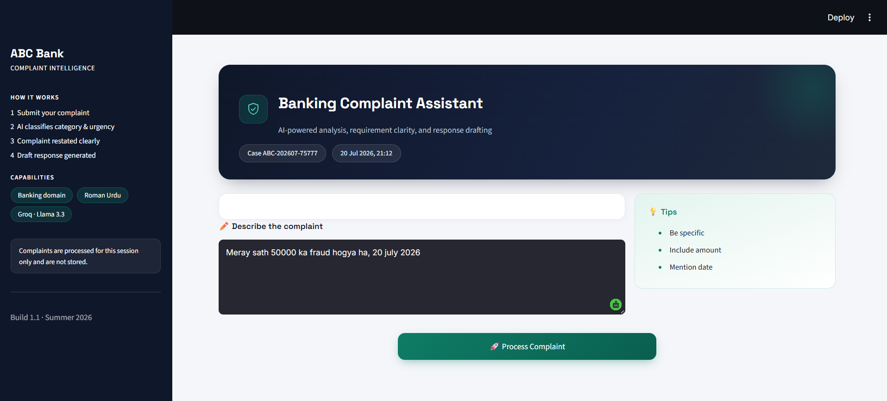
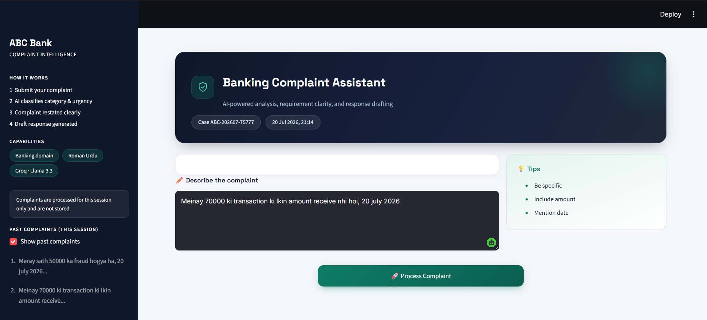
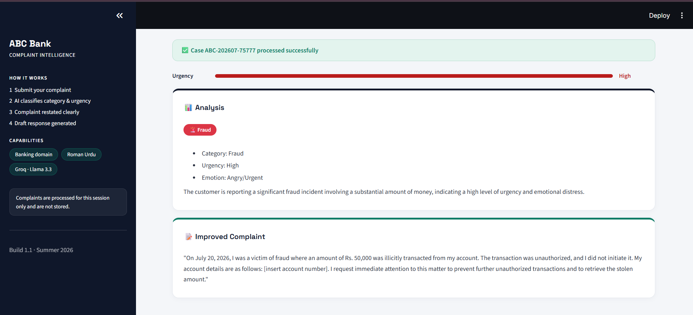
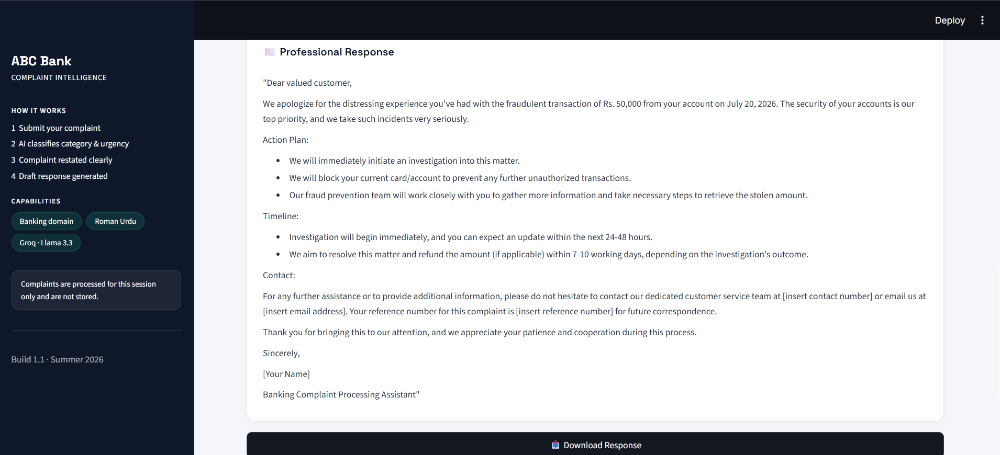

<div align="center">

#  AI Banking Complaint Assistant

### AI-Powered Complaint Response & Requirement Improvement System

[](https://www.python.org/)
[](https://streamlit.io/)
[](https://console.groq.com/)
[](#license)

An intelligent assistant that helps banking customers and employees process complaints quickly and professionally — analyzing tone and urgency, clarifying vague requirements, and generating polished banking responses in seconds.

</div>

---

##  Overview

**AI Banking Complaint Assistant** streamlines the complaint-handling workflow for banks and financial institutions. It uses a large language model (Groq's Llama 3.3 70B) to analyze incoming complaints, rewrite unclear or informal requirements into structured language, and draft professional, ready-to-send responses — including support for **Roman Urdu**, making it accessible to Pakistani users.

---

##  Features

| Feature | Description |
|---|---|
|  **Analyze** | Automatically detects complaint **category**, **urgency**, and **emotional tone** |
|  **Improve** | Converts unclear or informal complaints into clear, structured requirements |
|  **Respond** | Generates professional, ready-to-send banking replies |
|  **Toggle View** | Show/hide the generated response (Employee View mode) |
|  **Download** | Export the final response as a `.txt` file |
|  **History** | Keeps a session-based log of processed complaints |
| 🇵🇰 **Roman Urdu Support** | Understands and responds to complaints written in Roman Urdu |

---

##  Screenshots

<div align="center">

| Home Screen | Analysis Results |
|:---:|:---:|
|  |  |

| Improved Complaint | Professional Response |
|:---:|:---:|
|  |  |

</div>

> Place your screenshots inside the `screenshots/` folder using the file names above (or update the paths to match your own).

---

##  Technologies Used

| Component | Technology |
|---|---|
| **Frontend** | Streamlit |
| **Backend** | Python |
| **AI API** | Groq (Llama 3.3 70B) |
| **Environment** | Python 3.9+ |

---

##  Project Structure

```
Banking_Complaint_Assistant/
│
├── app.py                     # Main application
├── requirements.txt           # Dependencies
├── .env                       # API key (not committed)
├── screenshots/                # Demo screenshots
├── Mid_Project_Proposal.docx
├── Final_Project_Report.docx
└── README.md
```

---

##  Installation

### 1. Clone the repository
```bash
git clone https://github.com/your-username/banking-complaint-assistant.git
cd banking-complaint-assistant
```

### 2. Create a virtual environment
```bash
python -m venv venv
venv\Scripts\activate      # Windows
source venv/bin/activate   # Mac/Linux
```

### 3. Install dependencies
```bash
pip install -r requirements.txt
```

### 4. Create a `.env` file
```env
GROQ_API_KEY=your_groq_api_key_here
```

### 5. Run the application
```bash
streamlit run app.py
```

---

##  Usage

1. Enter a complaint in **English** or **Roman Urdu**
2. Click **"Process Complaint"**
3. View the **Analysis**, **Improved Complaint**, and **Professional Response**
4. Toggle the response view on/off as needed
5. Download the response as a `.txt` file

---

##  API Key

Get your free API key from [console.groq.com/keys](https://console.groq.com/keys)

---

##  Author

**Laiba Taqdis**
Course: *Generative AI in Software Development*
University: *Riphah International University*

</div>
